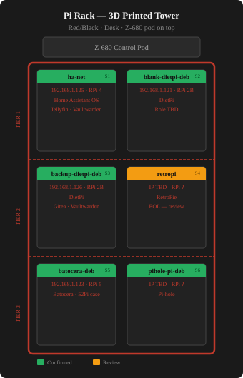

# Hardware Inventory
_Last updated: 2026-07-08_
_Physical hosts only — VMs/containers documented in network_context.md_
_Ordered by utility — least capable first, most capable last_
!!! tip "Adding Photos"
    Save host photos to `docs/images/hw/` and name them to match the image references below (e.g. `proxmox-deb.jpg`).
---
## Lab Audio

| Item | Model | Status | Location | Notes |
|------|-------|--------|----------|-------|
| Logitech Z-680 5.1 | Z-680 (THX, Dolby Digital, DTS) | ⚠️ **Partially functional** | Control pod on Pi rack | Only 1 speaker working. Sub caps blown — known failure mode for this model. Drew to recap sub or replace system. |

---

## Ewaste / Recycled
| Photo | System | Reason |
|-------|--------|--------|
| { width=100 } | MSI H61M-P23 (B3) — LGA1155 | Broken CPU cooler, won't POST — recycled |
---
## lee-deb — Dell Inspiron 3647
| | |
|--|--|
| { width=300 } | **Role:** Immich photo server — memorial machine **Make:** Dell Inspiron 3647 (Small Form Factor) **Chipset:** Intel H81 (Haswell, 2013) **CPU:** Unknown — up to i7-4790 (4th gen) **RAM:** Unknown — max 16GB DDR3 **Storage:** Samsung 870 EVO 1TB SSD (pending install) **OS:** Ubuntu Server 26.04 LTS (pending install) **IP:** Not yet assigned **PSU:** 220W — low-profile GPU only **Name:** lee — personal/memorial **Best uses:** Immich photo server, lightweight Linux utility box, PiHole **Easy upgrades:** SSD already planned. RAM cheap if needed. **Notes:** Sentimental machine — belongs to family. Original HDD preserved as-is. |
---
## restic-deb → blaine-pve (192.168.1.40)
| | |
|--|--|
| { width=300 } | **Role:** ⚠️ Planned repurpose — Proxmox VE node (blaine-pve). Currently Ubuntu 26.04 LTS. **Motherboard:** Gigabyte Z77-DS3H (Intel Z77, LGA1155) **CPU:** Intel Core i5-2500K @ 3.30GHz (Sandy Bridge 2011, 4c/4t) **RAM:** 32GB DDR3 (2x Samsung 8GB DDR3-1600 + 2x Timetec 8GB DDR3-1333) — upgraded 2026-06 **RAM max:** 32GB DDR3 — maxed **BIOS:** AMI F8 (2012-08-20) **OS:** Ubuntu 26.04 LTS (kernel 7.0.0-22-generic) → Proxmox VE (planned) **Form factor:** Thermaltake white full tower — 2x CRU hot-swap bays, USB 3.0 front panel **IP:** 192.168.1.40 **Name (current):** restic-deb — Greyhawk. **Planned name:** blaine-pve — Dark Tower (Blaine the Mono) **CRU scripts:** Committed to Gitea pre-wipe (192.168.1.3:3000/cos/scripts-restic-deb, commit 4ad5a94) **Best uses:** Proxmox node, CRU drive rotation (drives stay connected to PVE host), PBS mirror candidate |
### Storage
| Device | Type | Size | Filesystem | Mount | Notes |
|--------|------|------|------------|-------|-------|
| sdd | SSD | 238.5GB | ext4 | / | OS drive — Proxmox install target |
| sda | HDD (external) | 3.6TB | NTFS | /mnt/cru1 | CRU drive — stays connected post-Proxmox |
| sdb | HDD (external) | 3.6TB | NTFS | /mnt/cru3 | CRU drive — stays connected post-Proxmox |
| sdc | HDD (external) | 2.7TB | NTFS | /mnt/cru2 | CRU drive — stays connected post-Proxmox |
---
## truenas (192.168.1.5) — NAS Primary Storage
| | |
|--|--|
| { width=300 } | **Role:** NAS — primary storage **Motherboard:** Gigabyte Z77-DS3H (Intel Z77, LGA1155) — ⚠️ pending replacement with temerant hardware **CPU:** Intel Core i5-3570K @ 3.40GHz (4 cores) — Ivy Bridge 2012 — ⚠️ pending replacement **RAM:** 32GB DDR3-1600 (2x Crucial Ballistix 8GB + 2x Crucial UDIMM 8GB) — upgraded 2026-06 **RAM max:** 32GB DDR3 — maxed (pending upgrade to 32GB DDR4 via temerant hardware swap) **BIOS:** AMI F9 (2012-09-19) — CMOS battery replaced 2026-07-03 (board wasn't holding boot device order across power cycles) **OS:** TrueNAS CORE 13.0-U6.8 — migrated 2026-04-27 **Hostname:** freenas-bsd **NIC:** Intel X540-T2 `ix0` — ✅ PRIMARY as of 2026-07-04, static 192.168.1.5/24, confirmed active/stable at 1000baseT full-duplex (capped by SG200-50 switch, not the card). Earlier "suspected DOA" diagnosis was wrong — both ports showing "no link" via `dhclient` was because the interfaces were never brought administratively up (`ifconfig up`), not a hardware fault; once brought up, ix0 came up clean. `ix1` still DOWN, untested further, low priority. Onboard `alc0` (AR8161, alc driver) — retired 2026-07-04, physically unplugged. Had been severely throughput-limited (~340kB/s regardless of protocol/client, cause traced to marginal hardware/cabling, never fully root-caused) before being fully replaced by ix0. USB NIC (ue0) retired earlier. Separately: Dell 0THGMP (Intel I350-T4 quad-port) tried 2026-07-04 as an alternative — caused continuous beeping + auto-shutdown on this board, looks like a BIOS/Option ROM/CSM issue specific to this aging Z77-DS3H board rather than the card itself (reportedly worked fine in another machine previously, possibly shardik) — not resolved, not installed. **Form factor:** Beige full tower ATX (~1999) — 5x CRU hot-swap bays, 1x CRU bay available, 2x internal mounts available **Best uses:** NAS — irreplaceable 90TB RAIDZ1 pool. **History:** Case bought 1999. TRYAGAIN pool survived a motherboard failure — imported in 30 minutes after emergency mobo swap. No data loss. Migrated from FreeNAS 11.3 to TrueNAS 13.0 on 2026-04-27.  **⭐ Planned Hardware Rebuild — temerant components:** - Gigabyte AB350-Gaming (AMD B350, AM4) - Ryzen 5 1600X (6c/12t) - 32GB DDR4 - GTX 1080 Ti (Plex hardware transcoding) - 500GB SSD for TrueNAS OS boot (replace USB drives) - LSI 9207-8i or 9211-8i HBA (~$20-40 eBay) + 2x SFF-8087 breakout cables ⚠️ HBA not yet found — order if not located - Future: up to 8 drives total — 1x CRU hot-swap + 2x internal mounts available |
### Storage
| Pool | Drives | Size each | Raw Total | Layout | Status | Used | Free |
|------|--------|-----------|-----------|--------|--------|------|------|
| TRYAGAIN | 5x (ada0-ada4) | 18.19TiB | 90.9TB | RAIDZ1 — 1 drive parity | ✅ HEALTHY | 59.3TB (65%) | 31.6TB |
| boot-pool | 1x USB (da1) | 29GB SanDisk | 14GB | — | ⚠️ DEGRADED — USB boot drive needs replacement | 1.30GB | 12.7GB |
### TRYAGAIN Drives
| Device | Model | Serial | Size | Cage | Status |
|--------|-------|--------|------|------|--------|
| ada0 | Seagate Exos X20 ST20000NM007D | ZVT6XFQC | 18.19TiB | 3 | ONLINE |
| ada1 | Seagate Exos X20 ST20000NM007D | ZVT7CXJR | 18.19TiB | 2 | ONLINE |
| ada2 | Seagate Exos X20 ST20000NM007D | ZVT7B8G6 | 18.19TiB | 4 | ONLINE |
| ada3 | Seagate Exos X20 ST20000NM007D | ZVT7JN18 | 18.19TiB | 1 | ONLINE |
| ada4 | WD Ultrastar DC HC560 WUH722020BLE6L4 | 9BHXKBKL | 18.19TiB | 5 | ✅ ONLINE — replaced 2026-06, resilver complete |
### TRYAGAIN Datasets
| Dataset | Type | Used | Notes |
|---------|------|------|-------|
| plex | dataset | ~59TB | Main media — CIFS mounted on mediastack-deb |
| jails | dataset | 1.15TiB | Weltgeist + Alea Iacta Est — decommissioned, pending deletion |
| iocage | dataset | 91.74GiB | Jail manager — pending deletion |
| QUANTUM-g52439 | zvol | 25.61GiB | VM or iSCSI target |
### ZFS Health
- Last scrub: 2026-05-18 — repaired 1.11M, 0 errors
- ✅ ada4 replaced with WD HC560 WUH722020BLE6L4 — resilver complete 2026-06, pool HEALTHY
- ⚠️ boot-pool DEGRADED — USB boot drive needs replacement (parts available in reserve)
---
## Raspberry Pis
| Photo | Hostname | IP | Model | CPU | RAM | Storage | Best Use | Status |
|-------|----------|----|-------|-----|-----|---------|----------|--------|
| { width=100 } | pi3-deb | 192.168.1.124 | RPi Model B Rev 2 (BCM2835) Rev 000e — 256MB — clear RetroPie case | ARM 1-core | 239MB | 15GB SD | RetroPie/Buster — legacy, Python 3.7, cannot Ansible manage. Keep as NES/SNES/GB only. | Online |
| { width=100 } | pi1-deb | 192.168.1.120 | RPi Model B Rev 2 (BCM2835) Rev 000f — 512MB — blue-green case | ARM 1-core | 427MB | 3.8GB SD (91% full ⚠️) | Raspbian Bookworm — onboarded ✅ — Secondary PiHole or MQTT broker. Needs larger SD card. | Online |
| { width=100 } | pi2-deb | 192.168.1.121 | RPi Model B Rev 2 (BCM2835) Rev 000f — 512MB | ARM 1-core | 475MB | 7.2GB SD | Role TBD | Online |
| — | pi2b (unassigned) | TBD | Raspberry Pi 2 Model B (BCM2836) — 1GB | ARM 4-core | 1GB | — | DietPi flash planned (Sunday). Role TBD via first-run installer. | Not yet flashed |
| { width=100 } | pi4-deb | 192.168.1.126 | RPi 2 Model B Rev 1.1 (BCM2836) — 1GB — official white case | ARM 4-core | 762MB | 29GB SD | DietPi v10.2.3 — onboarded ✅ — Zigbee coordinator + MQTT broker | Online |
| { width=100 } | octopi-deb | 192.168.1.122 | RPi 4 Model B Rev 1.1 (BCM2711) — CanaKit clear case | ARMv7 4-core | 3.7GB | 29GB SD | OctoPrint — controls Creality Ender 3 V2 | Online |
| { width=100 } | ha-net | 192.168.1.125 | RPi 4 Model B Rev 1.4 — CanaKit black case | ARM 4-core | 3.7GB | 28.6GB | Home Assistant OS 17.2 / Core 2026.4.2 | Online |
| { width=100 } | batocera-deb | 192.168.1.123 | RPi 5 Model B Rev 1.0 | ARM 4-core | 3.9GB | 111GB SD | Best retro gaming — PS2, GameCube, Dreamcast, some Switch (Batocera) | Online |
| { width=100 } | argos-deb | 192.168.1.127 | RPi 4 Model B Rev 1.1 — 1GB — ewaste find! | ARM 4-core | 870MB | 32GB PNY | Fully kitted IoT field station — touchscreen, camera, LTE, LoRa | Online |

### Pi Rack — 3D Printed Red/Black Tower
_Photographed 2026-06-30. Desk location. Z-680 control pod sits on top shelf. 6-slot, 3-tier (2 per tier)._

{ width=500 }

| Slot | Hostname | IP | Model | Software | Notes |
|------|----------|----|-------|----------|-------|
| Top | — | — | — | — | Z-680 control pod rests here |
| S1 | ha-net | 192.168.1.125 | RPi 4 | Home Assistant OS · Jellyfin · Vaultwarden | Tier 1 left |
| S2 | blank-dietpi-deb | 192.168.1.121 | RPi 2B | DietPi | Tier 1 right — role TBD |
| S3 | backup-dietpi-deb | 192.168.1.126 | RPi 2B | DietPi · Gitea mirror · Vaultwarden backup | Tier 2 left |
| S4 | retropi | TBD | RPi ? | RetroPie | Tier 2 right — EOL, kept for patching only |
| S5 | batocera-deb | 192.168.1.123 | RPi 5 | Batocera | Tier 3 left — 52Pi case |
| S6 | pihole-pi-deb | TBD | RPi ? | Pi-hole | Tier 3 right |

---
## argos-deb (192.168.1.127)
| | |
|--|--|
| { width=300 } | **Role:** IoT field station — TBD **Model:** Raspberry Pi 4 Model B Rev 1.1 (BCM2711) **RAM:** 1GB (870MB available) **Storage:** 32GB PNY microSD (Bookworm 64-bit) **OS:** Raspberry Pi OS Bookworm 64-bit — onboarded ✅ **IP:** 192.168.1.127 **Origin:** Ewaste find — someone's serious IoT project **Display:** Official Raspberry Pi 7" touchscreen ✅ working **Camera:** Raspberry Pi Camera V2.1 — untested on Bookworm **Cellular:** Sixfab mPCI-E Base Shield V2 + Quectel EC25-A 4G LTE — needs SIM card **Radio:** Adafruit RFM9x LoRa — long range RF, GPIO connected **Best uses:** Mobile homelab node (Tailscale+LTE), LoRa gateway, security camera, HA kiosk display, field sensor station **Easy upgrades:** Add SIM card (Hologram.io), reconnect Sixfab shield, test LoRa radio |
---
## 3D Printers
| Photo | Printer | Type | Controller | Status | Notes |
|-------|---------|------|-----------|--------|-------|
| { width=100 } | Creality Ender 3 V1 | FDM | None assigned | Needs Pi | Could add another OctoPrint Pi |
| { width=100 } | Elegoo Mars 3 | Resin (MSLA) | None | Standalone | Chitubox slicer, no OctoPrint |
| { width=100 } | Flashforge Dreamer | FDM dual extrusion | None | Standalone | FlashPrint software |
| { width=100 } | Creality Ender 3 V2 | FDM | octopi-deb (OctoPrint) | ✅ Active | Controlled via RPi 4 |
---
## GPU Stock (undeployed)
| Photo | Item | Qty | VRAM | Notes |
|-------|------|-----|------|-------|
| { width=100 } | GTX 1080 | 4 (undeployed) | 8GB each | Pascal NVENC — 1 transcode stream, no AV1 |
| { width=100 } | GTX 1080 Ti | 4-5 total (1 in amontillado, 1 in aslan vfio, 1 earmarked for truenas rebuild, 1-2 undeployed) | 11GB VRAM | Best choice for AI/Ollama node — more VRAM than 1080 |
---
## pve3 (offsite — ThinkStation)
| | |
|--|--|
| { width=300 } | **Role:** Proxmox VE node 4 — offsite **Make:** Lenovo ThinkStation (model unknown) **CPU:** Unknown **RAM:** Unknown **Storage:** Unknown **OS:** Proxmox VE **Location:** Offsite **Tailscale:** Not yet configured **Best uses:** Proxmox node 4 — offsite DR **Notes:** Needs full inventory, Tailscale, and documentation |
---
## Unknown Waiting System
| Photo | # | Notes |
|-------|---|-------|
| { width=100 } | 5 | Unknown — not yet inventoried |
---
## urnst-deb (192.168.1.27)
| | |
|--|--|
| { width=300 } | **Role:** Hardware diagnostics + TBD — Proxmox node candidate **Motherboard:** Gigabyte AB350-Gaming-CF (AMD B350, AM4) **CPU:** AMD Ryzen 5 1600X (6c/12t, 3.6GHz) **RAM:** 16GB DDR4 2133 — upgraded 2026-06 (filled remaining slots from reserve) **RAM max:** 16GB DDR4 (4x 4GB) — maxed **GPU:** AMD Radeon HD 7450 — display only **OS:** Debian 13 (Trixie) — fresh install 2026-04-13 **Form factor:** Thermaltake white full tower — 2x 5.25" bays, front USB **IP:** 192.168.1.27 **Name:** Urnst — County of Urnst, Greyhawk **Best uses:** Proxmox node candidate, PBS backup server, general Linux server, CPU swap test bench **Easy upgrades:** Replace HD 7450 with GTX 1080/1080 Ti from stock. |
### Storage
| Device | Type | Size | Notes |
|--------|------|------|-------|
| sda | HDD | 2.7TB | OS drive — Debian installed |
| sdb | HDD | 2.7TB | Empty |
| sdc | HDD | 2.7TB | Empty |
---
## maturin (192.168.1.7) — Proxmox node 2
| | |
|--|--|
| { width=300 } | **Role:** Proxmox VE node 2 **Make:** Dell OptiPlex 7050 (SFF) **Motherboard:** Dell 0NW6H5 **CPU:** Intel Core i7-6700 @ 3.40GHz (4c/8t, Skylake 2015) **RAM:** 32GB DDR4 2133MHz (4x 8GB — 2x Micron 8ATF1G64AZ-2G6E1 + 2x Samsung M378A1G43EB1-CPB, mixed kit) **RAM max:** 64GB DDR4 (4x 16GB) **BIOS:** Dell 1.11.0 (2018-11-01) **OS:** Proxmox VE / Debian 12 **IP:** 192.168.1.7 **Form factor:** Small form factor desktop **Best uses:** Proxmox node 2 — runs monitor-deb, git-ansible, docker-deb, mediastack-deb **Easy upgrades:** RAM to 64GB DDR4 (4x 16GB). |
### Storage
| Device | Type | Size | Model | Role |
|--------|------|------|-------|------|
| sda | SSD | 476.9GB | Samsung PM871a | OS — LVM (root 96GB, data pool 348GB, swap 8GB) |
| nvme0n1 | NVMe | 931.5GB | Samsung 980 Pro 1TB | nvme_store — dedicated VM storage pool |
### VMs on maturin
| VMID | Name | Type | Status | vCPUs | RAM | Disk |
|------|------|------|--------|-------|-----|------|
| 106 | git-ansible | VM | running | 4 | 4GB | 64GB |
| 107 | docker-deb | VM | running | 2 | 4GB | 64GB |
| 113 | mediastack-deb | VM | running | 4 | 16GB | 150GB |
| 900 | ubuntu-24.04-template | template | stopped | 1 | 1GB | 32GB |
---
## aslan (192.168.1.9) — Proxmox node 3
| | |
|--|--|
| { width=300 } | **Role:** Proxmox VE node 3 — GPU passthrough host **Motherboard:** Gigabyte AB350-Gaming 3-CF (AMD B350, AM4) **CPU:** AMD Ryzen 5 1600X (6c/12t, 3.6GHz) **RAM:** 64GB DDR4-2666 (4x16GB, all 4 slots filled — confirmed via `dmidecode -t memory` 2026-07-08, corrects prior stale 32GB entry) **RAM max:** 128GB DDR4 **Storage:** Samsung 970 EVO Plus 500GB NVMe (sdc — LVM root + thin pool), 3TB HDD (sda → /mnt/hdd3tb = SDA_store), 12TB HDD (sdb → /mnt/hdd12tb, 22 uncorrectable errors — non-critical only) **GPU:** GTX 1080 Ti — bound to vfio-pci (10de:1b06, 10de:10ef), IOMMU group 2 **OS:** Proxmox VE 9.2.3 **IP:** 192.168.1.9 **Name:** Aslan — Guardian of the Beam, Dark Tower **History:** Was idee-deb (Greyhawk). Repurposed as Proxmox node 3 — 2026-06-16. **Notes:** No physical console — Ryzen has no iGPU and GPU is vfio. Manage via SSH/web UI only. |
### Storage Layout
| Store | Path | Device | Size | Notes |
|-------|------|--------|------|-------|
| local | / | sdc LVM | ~96GB ext4 | root filesystem |
| local-lvm | thin pool | sdc LVM | 1.71TB | fast VM storage — 16GB free PE |
| SDA_store | /mnt/pve/SDA_store | /dev/sda | 3TB | VM images + PBS backup data |
| hdd12tb | /mnt/hdd12tb | /dev/sdb | 12TB | bulk only — 22 uncorrectable sectors |
### VMs & LXC on aslan
| VMID | Name | Type | Status | vCPUs | RAM | Disk | Notes |
|------|------|------|--------|-------|-----|------|-------|
| 104 | swarm02-worker | VM | stopped | 4 | 2GB | 64GB | migrated from shardik 2026-06-16 |
| 105 | swarm03-worker | VM | stopped | 4 | 2GB | 64GB | migrated from shardik 2026-06-16 |
| 108 | alma-rpm | VM | running | 1 | 2GB | 32GB | migrated from shardik 2026-06-16 |
| 109 | rocky-rpm | VM | running | 1 | 2GB | 32GB | migrated from shardik 2026-06-16 |
| 110 | pihole-book-deb | LXC | running | 1 | 512MB | 7.78GB | migrated from shardik 2026-06-16 |
| 111 | kasm-2404-deb | VM | running | 2 | 4GB | 32GB | disk on SDA_store — move to local-lvm pending |
| 115 | pbs | VM | running | 2 | 4GB | 32GB | PBS datastore on SDA_store (600GB virtual, 317GB used) |
---
## temerant-win (192.168.1.105) — ⭐ Donor system for TrueNAS rebuild
| | |
|--|--|
| { width=300 } | **Role:** Hardware donor for TrueNAS rebuild — pending data check **Motherboard:** Gigabyte AB350-Gaming (AMD B350, AM4) **CPU:** AMD Ryzen 5 1600X (6c/12t, 3.6GHz) **RAM:** 32GB DDR4 2133 (4x 8GB G.Skill F4-2400C15 — full 4 slots) **RAM max:** 64GB DDR4 **GPU:** NVIDIA GeForce GTX 1080 Ti (11GB VRAM) ✅ already installed **OS:** Windows 10 Pro (1909 — EOL) — LaunchBox/ROM gaming **Form factor:** Mid-tower, tempered glass, AIO cooler, RGB **IP:** 192.168.1.105 **Name:** Temerant — world of Kingkiller Chronicle (Rothfuss) **Planned fate:** Gut mobo + CPU + RAM + GPU + 500GB SSD → install into TrueNAS beige full tower. Temerant chassis retired. **⚠️ Before gutting:** Check 2x 3TB HDDs for important data. Move to urnst-deb or eld-win if needed. **Notes:** Currently used for LaunchBox ROM gaming (Z:\ROMs mapped from \\freenas\plex\ROMs). RetroAchievements configured. |
### Storage
| Device | Type | Size | Notes |
|--------|------|------|-------|
| Disk C: | SSD | 500GB | OS drive — will become TrueNAS boot drive |
| Disk D: | HDD | 3TB | Seagate ST3000DM001 — check for data ⚠️ |
| Disk E: | HDD | 3TB | Seagate ST3000DM001 — check for data ⚠️ |
---
## shardik (192.168.1.2) — Proxmox node 1
| | |
|--|--|
| { width=300 } | **Role:** Proxmox VE node 1 — primary hypervisor **Motherboard:** ASRock AB350M Pro4 **CPU:** ✅ AMD Ryzen 7 2700X (8c/16t, 3.7GHz) — upgraded 2026-06 **RAM:** ✅ 64GB DDR4 2667MHz — upgraded 2026-06 **RAM max:** 64GB — maxed **BIOS:** AMI P10.43 **OS:** Proxmox VE / Debian 12 **Form factor:** Cooler Master full tower — 5x CRU hot-swap bays, LG optical **IP:** 192.168.1.2 **ZFS:** Masked off (systemd.mask=zfs-mount.service) — ZFS recovery failed 2026-05, node rebuilt **⚠️ PSU:** Suspected failure — Sunday project to replace. **Best uses:** Primary hypervisor **Easy upgrades:** Replace PSU ⚠️ |
### Storage
| Device | Type | Size | Model | FS |
|--------|------|------|-------|----|
| nvme0n1 | NVMe | 1.02TB | Kioxia KXG60ZNV1T02 | LVM (OS) |
| sda | HDD | 6TB | Seagate ST6000DX000 | ext4 |
| sdb | HDD | 6TB | Toshiba HDWE160 | ZFS |
| sdc | HDD | 6TB | Toshiba HDWE160 | ext4 |
| sdd | HDD | 6TB | Seagate ST6000VN0001 | ZFS |
### VMs & LXC on shardik
| VMID | Name | Type | Status | vCPUs | RAM | Disk |
|------|------|------|--------|-------|-----|------|
| 102 | swarm01-manager | VM | stopped | 4 | 2GB | 64GB | ⏳ pending migration to aslan |
---
## amontillado-win (192.168.1.100) ⭐ Best System
| | |
|--|--|
| { width=300 } | **Role:** Primary workstation / Hyper-V host / AI powerhouse **Motherboard:** MSI PRO Z690-A WIFI (MS-7D25) **CPU:** Intel i7-13700K (16 cores / 24 threads — Raptor Lake 2022) **RAM:** 128GB DDR5 4000MHz — 4x 32GB: G.Skill + Crucial **BIOS:** AMI A.F0 (2023-11-13) **OS:** Windows 11 + Hyper-V **GPU:** NVIDIA GeForce GTX 1080 Ti (11GB VRAM) + Intel UHD Graphics **Form factor:** Phanteks Eclipse P400A — mesh front, tempered glass, RGB **IP:** 192.168.1.100 **Name:** Amontillado — Poe **Best uses:** Primary workstation, Hyper-V host, AI workloads, heavy compilation, anything that needs 128GB RAM **Easy upgrades:** Upgrade GPU to RTX 3090/4090 for serious AI work — i7-13700K won't bottleneck it. |
### Storage
| Drive | Size | FS | Label | Free | Notes |
|-------|------|----|-------|------|-------|
| Disk 0 | 465GB | NTFS | F: | 39% | — |
| Disk 1 | 2.79TB | NTFS | D: New Volume | 11% ⚠️ | VMs + junk — audit needed |
| Disk 2 | 931GB | NTFS | C: OS | 20% | — |
