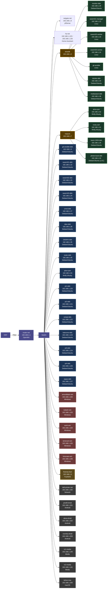

# Network Diagram

_Last update: 2026-05-15 21:13:10_

```mermaid
graph LR

    ONT[ONT]
    Router["router-net<br/>192.168.1.1<br/>OpenWrt"]
    Switch[Switch]
    ONT -->|Fiber| Router
    Router --> Switch
    netgate_net["netgate-net<br/>192.168.1.6<br/>pfSense"]
    Switch --> netgate_net

    ha_net["ha-net<br/>192.168.1.125 / 192.168.1.135<br/>Home Assistant"]
    Switch --> ha_net

    shardik["shardik<br/>192.168.1.2"]
    Switch --> shardik
    monitor_deb["monitor-deb<br/>192.168.1.29<br/>Debian/Ubuntu"]
    shardik --> monitor_deb
    swarm01_manager["swarm01-manager<br/>192.168.1.22<br/>Linux"]
    shardik --> swarm01_manager
    swarm02_worker["swarm02-worker<br/>192.168.1.23<br/>Linux"]
    shardik --> swarm02_worker
    swarm03_worker["swarm03-worker<br/>192.168.1.24<br/>Linux"]
    shardik --> swarm03_worker
    git_ansible["git-ansible<br/>Linux"]
    shardik --> git_ansible
    docker_deb["docker-deb<br/>192.168.1.34<br/>Debian/Ubuntu"]
    shardik --> docker_deb
    mediastack_deb["mediastack-deb<br/>192.168.1.36<br/>Debian/Ubuntu"]
    shardik --> mediastack_deb

    maturin["maturin<br/>192.168.1.7"]
    Switch --> maturin
    alma_rpm["alma-rpm<br/>192.168.1.52<br/>RHEL/Rocky"]
    maturin --> alma_rpm
    rocky_rpm["rocky-rpm<br/>192.168.1.51<br/>RHEL/Rocky"]
    maturin --> rocky_rpm
    kasm_2404_deb["kasm-2404-deb<br/>192.168.1.26<br/>Debian/Ubuntu"]
    maturin --> kasm_2404_deb
    pihole_book_deb["pihole-book-deb<br/>192.168.1.33<br/>Debian/Ubuntu (LXC)"]
    maturin --> pihole_book_deb

    git_ansible_deb["git-ansible-deb<br/>192.168.1.3<br/>Debian/Ubuntu"]
    Switch --> git_ansible_deb
    swarm01_deb["swarm01-deb<br/>192.168.1.22<br/>Debian/Ubuntu"]
    Switch --> swarm01_deb
    swarm02_deb["swarm02-deb<br/>192.168.1.23<br/>Debian/Ubuntu"]
    Switch --> swarm02_deb
    swarm03_deb["swarm03-deb<br/>192.168.1.24<br/>Debian/Ubuntu"]
    Switch --> swarm03_deb
    urnst_deb["urnst-deb<br/>192.168.1.27<br/>Debian/Ubuntu"]
    Switch --> urnst_deb
    idee_deb["idee-deb<br/>192.168.1.28<br/>Debian/Ubuntu"]
    Switch --> idee_deb
    2404HV_deb["2404HV-deb<br/>192.168.1.35<br/>Debian/Ubuntu"]
    Switch --> 2404HV_deb
    restic_deb["restic-deb<br/>192.168.1.40<br/>Debian/Ubuntu"]
    Switch --> restic_deb
    plow_rpm["plow-rpm<br/>192.168.1.53<br/>RHEL/Rocky"]
    Switch --> plow_rpm
    pi1_deb["pi1-deb<br/>192.168.1.120<br/>Debian/Ubuntu"]
    Switch --> pi1_deb
    pi2_deb["pi2-deb<br/>192.168.1.121<br/>Debian/Ubuntu"]
    Switch --> pi2_deb
    octopi_deb["octopi-deb<br/>192.168.1.122<br/>Debian/Ubuntu"]
    Switch --> octopi_deb
    batocera_deb["batocera-deb<br/>192.168.1.123<br/>Debian/Ubuntu"]
    Switch --> batocera_deb
    pi3_deb["pi3-deb<br/>192.168.1.124<br/>Debian/Ubuntu"]
    Switch --> pi3_deb
    pi4_deb["pi4-deb<br/>192.168.1.126<br/>Debian/Ubuntu"]
    Switch --> pi4_deb
    argos_deb["argos-deb<br/>192.168.1.127<br/>Debian/Ubuntu"]
    Switch --> argos_deb
    amontillado_win["amontillado-win<br/>192.168.1.100<br/>Windows"]
    Switch --> amontillado_win
    todash_win["todash-win<br/>192.168.1.103<br/>Windows"]
    Switch --> todash_win
    work_win["work-win<br/>192.168.1.104<br/>Windows"]
    Switch --> work_win
    temerant_win["temerant-win<br/>192.168.1.105<br/>Windows"]
    Switch --> temerant_win
    fortunato_win["fortunato-win<br/>192.168.1.106<br/>Windows"]
    Switch --> fortunato_win
    freenas_bsd["freenas-bsd<br/>192.168.1.5<br/>TrueNAS"]
    Switch --> freenas_bsd
    dell_printer_net["dell-printer-net<br/>192.168.1.162<br/>Network"]
    Switch --> dell_printer_net
    pixel8_droid["pixel8-droid<br/>192.168.1.201<br/>Android"]
    Switch --> pixel8_droid
    alexa_droid["alexa-droid<br/>192.168.1.202<br/>Android"]
    Switch --> alexa_droid
    roomba_droid["roomba-droid<br/>192.168.1.203<br/>Android"]
    Switch --> roomba_droid
    tv1_media["tv1-media<br/>192.168.1.140<br/>Media"]
    Switch --> tv1_media
    tv2_media["tv2-media<br/>192.168.1.141<br/>Media"]
    Switch --> tv2_media
    tahoe_mac["tahoe-mac<br/>192.168.1.200<br/>macOS"]
    Switch --> tahoe_mac

    classDef infra fill:#4a4a8a,stroke:#9999cc,color:#fff
    classDef proxmox fill:#5a3e00,stroke:#e8a000,color:#fff
    classDef vm fill:#1a3a2a,stroke:#4caf50,color:#fff
    classDef linux fill:#1d3557,stroke:#457b9d,color:#fff
    classDef windows fill:#6d3a3a,stroke:#c1666b,color:#fff
    classDef bsd fill:#5c4a1e,stroke:#d4a017,color:#fff
    classDef network fill:#3a3a3a,stroke:#888,color:#fff
    classDef other fill:#4a2d5a,stroke:#9b72cf,color:#fff

    class ONT,Router,Firewall,Switch infra
    class shardik proxmox
    class monitor_deb vm
    class swarm01_manager vm
    class swarm02_worker vm
    class swarm03_worker vm
    class git_ansible vm
    class docker_deb vm
    class mediastack_deb vm
    class maturin proxmox
    class alma_rpm vm
    class rocky_rpm vm
    class kasm_2404_deb vm
    class pihole_book_deb vm
    class git_ansible_deb linux
    class swarm01_deb linux
    class swarm02_deb linux
    class swarm03_deb linux
    class urnst_deb linux
    class idee_deb linux
    class 2404HV_deb linux
    class restic_deb linux
    class plow_rpm linux
    class pi1_deb linux
    class pi2_deb linux
    class octopi_deb linux
    class batocera_deb linux
    class pi3_deb linux
    class pi4_deb linux
    class argos_deb linux
    class amontillado_win windows
    class todash_win windows
    class work_win windows
    class temerant_win windows
    class fortunato_win windows
    class freenas_bsd bsd
    class dell_printer_net network
    class pixel8_droid network
    class alexa_droid network
    class roomba_droid network
    class tv1_media network
    class tv2_media network
    class tahoe_mac network
```
